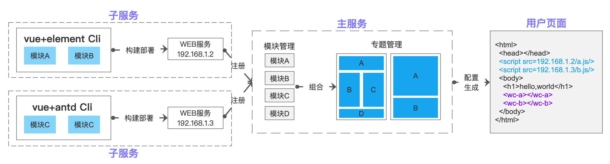

## 基于ws的微服务框架
> 微服务框架有多种实现方式，这里采用web components技术来实现，其中分为主服务和子服务两个模块，下面分别进行开发
## Demo

## Live Demo
http://68.168.137.218:3000/index.html

## 架构图

## 架构图2

### 1、子服务
##### 脚手架
> 基于@vue/cli4.1.1

参考资料
+ 1、https://juejin.im/post/5d1d8d426fb9a07efe2dda40
+ 2、https://alili.tech/archive/ea599f7c/